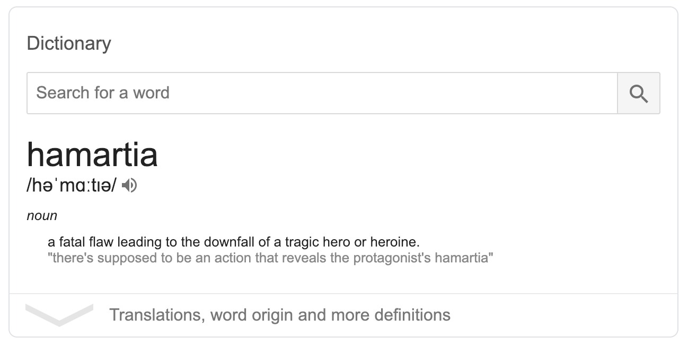

import { darkLayout } from "../../../src/theme";

export default darkLayout

# Hamartia
---

---
# Two sites, no mingling
---
This is bad because:

  Things get out of sync
---
This is bad because:

  There is not a clear source of truth
---
This is bad because:

  Our disciplines cannot be isolated from each other
---
(don't worry though, we got this)
