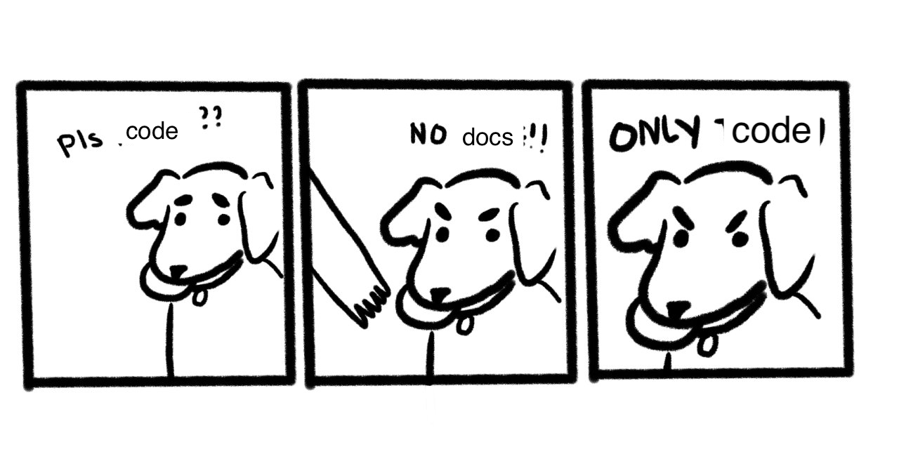

import { darkLayout, lightLayout } from "../../../src/theme";
import { Appear, Code } from "mdx-deck";

# Extracting Types From Your Components

<br />
<br />
<br />

### By Ben Conolly ([@noviny](https://github.com/noviny) on the internets)

---

## Today we're going to be talking about:

- Why you should document your components
- How easy this can be
- Here's one we built, and how we built it

---

export default lightLayout;



---

## Why you should document your components

---

<ul style={{ textAlign: "left" }}>
  <Appear>
    <li>Documentation helps explain intent</li>
    <li>It makes working on the codebase easier in the future</li>
    <li>The person it's helping can easily be you</li>
    <li>
      (Having to write out and explain things helps you write better code)
    </li>
  </Appear>
</ul>

---

## So... component docs eh?

---

<ul style={{ textAlign: "left" }}>
  <Appear>
    <li>You should always (preferably) have documentation</li>
    <li>
      You need to document your APIs, for react components, that's the props
    </li>
    <li>
      If you are writing React, you are probably already 'documenting' your
      props
    </li>
    <li>We can pull this info directly from the code</li>
  </Appear>
</ul>

---

## Thankfully there's tools that help you do this

---

export default darkLayout;

## react-docgen

https://github.com/reactjs/react-docgen

<ul style={{ textAlign: "center", listStyle: "none" }}>
  <Appear>
    <li>✅ Prop-Types</li>
    <li>❌ Flow (but it supports this now)</li>
    <li>❌ Typescript</li>
    <li>❌ Cross-file type imports</li>
  </Appear>
</ul>

---

export default darkLayout;

## react-docgen-typescript

https://github.com/styleguidist/react-docgen-typescript

<ul style={{ textAlign: "center", listStyle: "none" }}>
  <Appear>
    <li>❌ Prop-Types</li>
    <li>❌ Flow (but it supports this now)</li>
    <li>✅ Typescript</li>
    <li>❌ Cross-file type imports</li>
  </Appear>
</ul>

---

## How hard can it be to build our own?

---

<ul style={{ textAlign: "left" }}>
  <Appear>
    <li>
      Step 1: Just parse types out of the AST, and take the comments above them
      as the text
    </li>
    <li>
      Step 2: We really really want cross-file imports, let's 'just' add that
    </li>
    <li>Step 3: Sure, no, sure, we can support default props</li>
    <li>4: Sure, why not typescript?</li>
    <li>
      Step 5: Oh god we keep breaking the website, we need a second library
    </li>
    <li>Step 6: Oh look, we can now use this everywhere</li>
  </Appear>
</ul>

---

export default darkLayout;

import { syntaxHighlighter } from "mdx-deck/themes";
export const themes = [syntaxHighlighter];

```jsx
import { Props } from "prett-proptypes";
import MyCoolComponent from "../MyCoolComponent";

<Props heading="My Cool Component" component={MyCoolComponent} />;
```

(and a cheeky babel plugin)

```json
{
  "plugins": ["babel-plugin-extract-react-types"]
}
```

---

export default darkLayout;

```jsx
import Props from "pretty-proptypes";

<Props
  heading="My Cool Component"
  props={require("!!extract-react-types-loader!../my-cool-component.js")}
/>;
```

---

export default darkLayout;

## How did we do?

<ul style={{ textAlign: "center", listStyle: "none" }}>
  <Appear>
    <li>❌ Prop-Types</li>
    <li>✅ Flow (but it supports this now)</li>
    <li>✅ Typescript</li>
    <li>✅ Cross-file type imports</li>
    <li>✅ Default Props</li>
    <li>✅ Customiseable renderer</li>
  </Appear>
</ul>

---

I want to check it out!

[Excellent, try this](https://extract-react-types.com/repl)

(this cool stuff was made by [Ajay Mathur](https://github.com/ajaymathur))

---

export default darkLayout;

## Noviny's quick guide to documenting your props

|     Feature      | [react-docgen](https://github.com/reactjs/react-docgen) | [react-docgen-typescript](https://github.com/styleguidist/react-docgen-typescript) | [extract-react-types](extract-react-types.com) |
| :--------------: | :-----------------------------------------------------: | :--------------------------------------------------------------------------------: | :--------------------------------------------: |
|    Prop-Types    |                           ✅                            |                                         ❌                                         |                       ❌                       |
|       Flow       |                           ✅                            |                                         ❌                                         |                       ✅                       |
|    Typescript    |                           ❌                            |                                         ✅                                         |                       ✅                       |
| Cross-file-types |                           ❌                            |                                         ✅                                         |                       ✅                       |
|  Default Props   |                           ❌                            |                                         ✅                                         |                       ✅                       |

---

🤔🤔🤔

Parting thought, what if we just extracted other types, from functions or objects?

🤔🤔🤔

---

If you want to check out extract-react-types:

[extract-react-types.com](extract-react-types.com)

https://github.com/atlassian/extract-react-types

---

export default darkLayout;

# Thanks for listening!

Any questions?

(or reach out to me on twitter @noviny)
