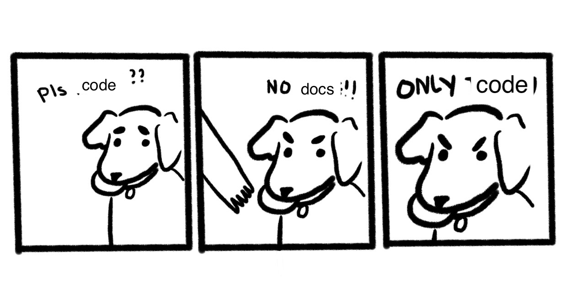

import { darkLayout, lightLayout } from "../../../src/theme";
import CodeBlock from "../../../src/CodeBlock";
import { Appear, FullScreenCode } from "mdx-deck";
import Prism from "prismjs";
import "prismjs/components/prism-jsx";
import "prismjs/themes/prism-tomorrow.css";

# Extracting Types From Your Components

 
 
 

### By Ben Conolly ([@noviny](https://github.com/noviny) on the internets)

---

## Today we're going to be talking about:

- Why you should document your components
- How easy this can be
- Some tools that help you out

---

## Why you should document your code

<ul style={{ textAlign: "left" }}>
  <Appear>
    <li>It makes your code easier to reuse</li>
    <li>It makes working on the codebase faster and easier in the future</li>
    <li>The person it's helping can easily be you</li>
    <li>
      (Having to write out and explain things helps you write better code)
    </li>
  </Appear>
</ul>

---

export default lightLayout;

---

export default lightLayout;

---

## So... component docs eh?

<ul style={{ textAlign: "left" }}>
  <Appear>
    <li>You should always (preferably) have documentation</li>
    <li>
      You need to document your APIs, for react components, that's the props
    </li>
    <li>
      If you are writing React, you are probably already 'documenting' your
      props
    </li>
    <li>We can pull this info directly from the code</li>
  </Appear>
</ul>

---

## Thankfully there's tools that can make this faster to do

---

export default darkLayout;

## react-docgen

https://github.com/reactjs/react-docgen

<ul style={{ textAlign: "center", listStyle: "none" }}>
  <Appear>
    <li>✅ Prop-Types</li>
    <li>❌ Flow (but it supports this now)</li>
    <li>❌ Typescript</li>
    <li>❌ Cross-file type imports</li>
  </Appear>
</ul>

---

export default darkLayout;

## react-docgen-typescript

https://github.com/styleguidist/react-docgen-typescript

<ul style={{ textAlign: "center", listStyle: "none" }}>
  <Appear>
    <li>❌ Prop-Types</li>
    <li>❌ Flow</li>
    <li>✅ Typescript</li>
    <li>✅ Cross-file type imports</li>
  </Appear>
</ul>

---

## How hard can it be to build our own?

---

export default darkLayout;

<CodeBlock
  snippet={`
export type ButtonProps = {
  /** The base styling to apply to the button. */
  appearance?: ButtonAppearances;
  /** Provides a url for buttons being used as a link. */
  href?: string;
  /** Set if the button is disabled. */
  isDisabled: boolean;
  /**
   * Set if the button is loading. When isLoading
   * is true, text is hidden, and
   * a spinner is shown in its place. The
   * button maintains the width that it
   * would have if the text were visible.
   */
  isLoading: boolean;
  /** Change the style to indicate the button is selected. */
  isSelected: boolean;
};
`}
/>

---

<ul style={{ textAlign: "left" }}>
  <li>
    Just parse types out of the AST, and take the comments above them as the
    text
  </li>
</ul>

---

export default darkLayout;

<CodeBlock
  snippet={`function convert(path, context) {
  if (typeof path.get !== "function")
    throw new Error(
      \`Did not pass a NodePath to convert() \${JSON.stringify(path)}\`
    );
  let converter = converters[path.type];
  if (!converter) throw new Error(\`Missing converter for: \${path.type}\`);
  let result = converter(path, context);
  attachComments(path.node, result);
  
  return result;
}`}
/>

---

export default darkLayout;

<CodeBlock
  snippet={`function convert(path, context) {
  let converter = converters[path.type];
  let result = converter(path, context);
  attachComments(path.node, result);
  
  return result;
}`}
/>

---

export default darkLayout;

<CodeBlock
  snippet={`
converters.StringTypeAnnotation = (path) => {
  return { kind: "string" };
};
  `}
/>

---

We only added converters when we needed them

---

<ul style={{ textAlign: "left" }}>
  <li>
    Just parse types out of the AST, and take the comments above them as the
    text
  </li>
  <Appear>
    <li>We really really want cross-file imports, let's 'just' add that</li>
    <li>Sure, no, sure, we can support default props</li>
    <li>Wait, can we support typescript?</li>
    <li>Oh god we keep breaking the website</li>
  </Appear>
</ul>

---

What we're outputing is basically an AST

What if we formalised this?

---

export default darkLayout;

<CodeBlock
  snippet={`
// docs-file.js
import { Props } from "prett-proptypes";
import MyCoolComponent from "../MyCoolComponent";

<Props heading="My Cool Component" component={MyCoolComponent} />;
  `}
/>

##### (and a cheeky babel plugin)

<CodeBlock
  snippet={`
// babel.config.js  
{
  "plugins": ["babel-plugin-extract-react-types"]
}`}
/>

---

export default darkLayout;

<CodeBlock
  snippet={`
// docs-file.js
import Props from "pretty-proptypes";

<Props
  heading="My Cool Component"
  props={require("!!extract-react-types-loader!../my-cool-component.js")}
/>;
`}
/>

---

<ul style={{ textAlign: "left" }}>
  <li>
    Just parse types out of the AST, and take the comments above them as the
    text
  </li>
  <li>We really really want cross-file imports, let's 'just' add that</li>
  <li>Sure, no, sure, we can support default props</li>
  <li>Wait, can we support typescript?</li>
  <li>Oh god we keep breaking the website</li>
  <Appear>
    <li>Oh look, we can use this everywhere now</li>
  </Appear>
</ul>

---

export default darkLayout;

## How did we do?

<ul style={{ textAlign: "center", listStyle: "none" }}>
  <Appear>
    <li>❌ Prop-Types</li>
    <li>✅ Flow</li>
    <li>✅ Typescript</li>
    <li>✅ Cross-file type imports</li>
    <li>✅ Default Props</li>
    <li>✅ Customiseable renderer</li>
  </Appear>
</ul>

---

I want to check it out!

[Excellent, try this](https://extract-react-types.com/repl)

(repl made by [Ajay Mathur](https://github.com/ajaymathur))

---

export default darkLayout;

## Noviny's quick guide to documenting your props

|     Feature      | [react-docgen](https://github.com/reactjs/react-docgen) | [react-docgen-typescript](https://github.com/styleguidist/react-docgen-typescript) | [extract-react-types](extract-react-types.com) |
| :--------------: | :-----------------------------------------------------: | :--------------------------------------------------------------------------------: | :--------------------------------------------: |
|    Prop-Types    |                           ✅                            |                                         ❌                                         |                       ❌                       |
|       Flow       |                           ✅                            |                                         ❌                                         |                       ✅                       |
|    Typescript    |                           ❌                            |                                         ✅                                         |                       ✅                       |
| Cross-file-types |                           ❌                            |                                         ✅                                         |                       ✅                       |
|  Default Props   |                           ❌                            |                                         ✅                                         |                       ✅                       |

---

🤔🤔🤔

Parting thought, what if we just extracted other types, from functions or objects?

🤔🤔🤔

---

export default darkLayout;

# Thanks for listening!

Any questions?

#### (or reach out to me on twitter @noviny)

##### [extract-react-types.com](extract-react-types.com)

##### https://github.com/atlassian/extract-react-types
